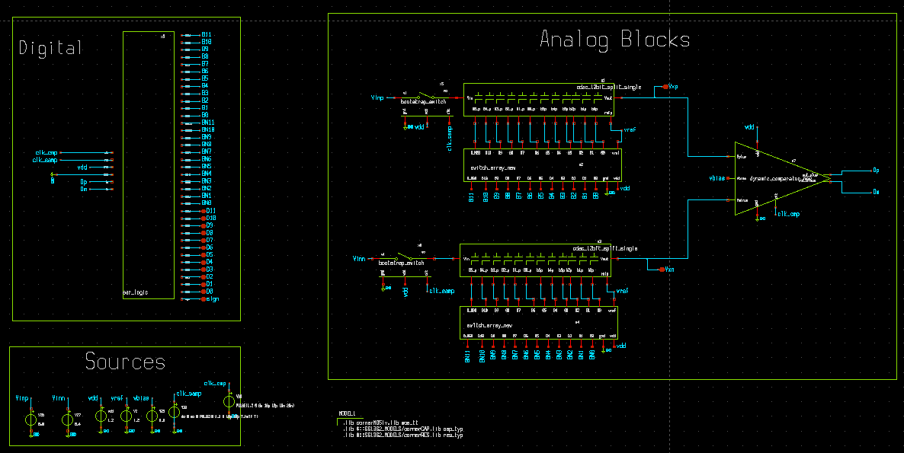
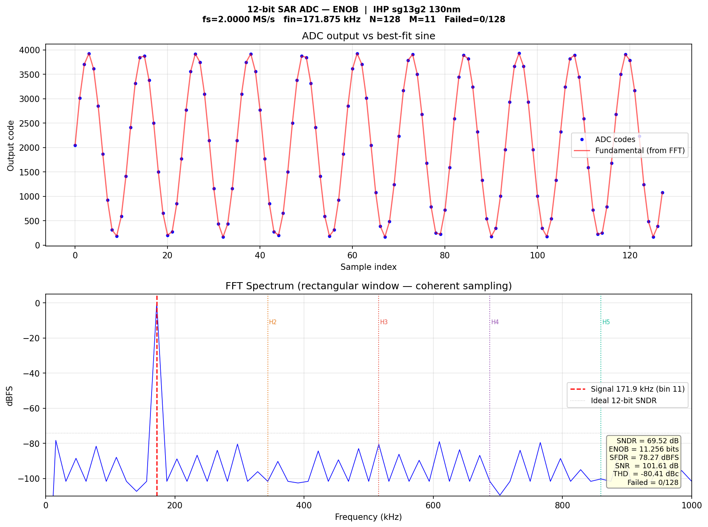
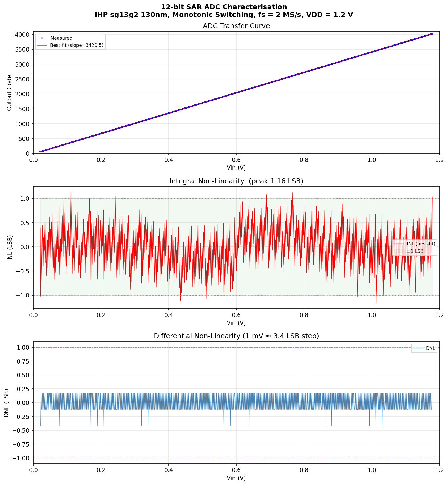
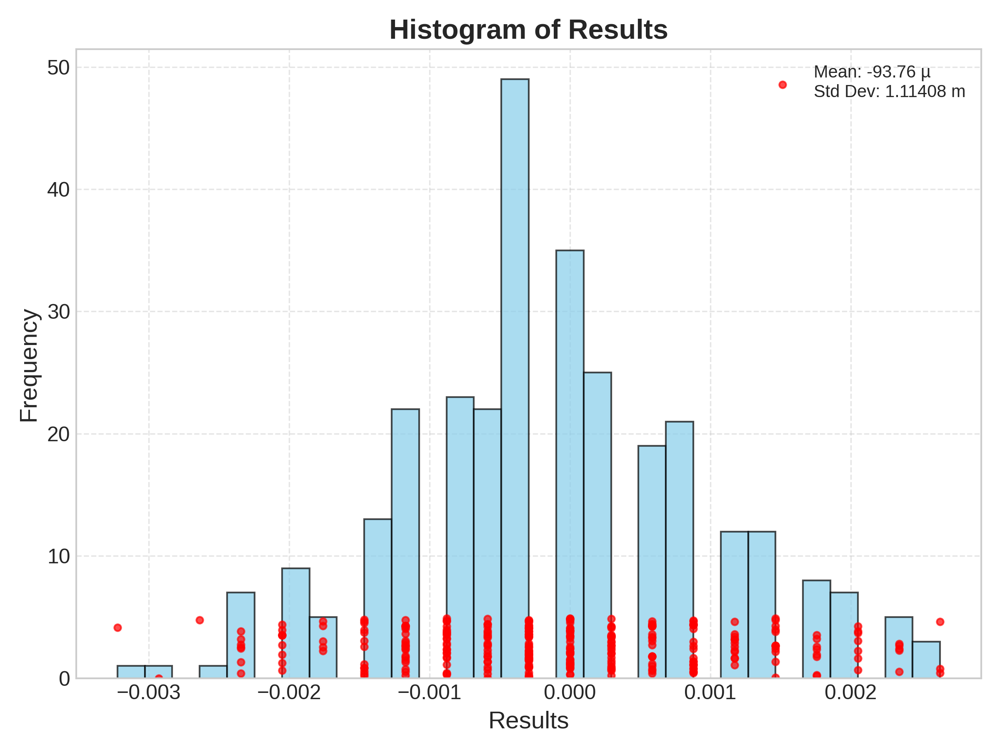
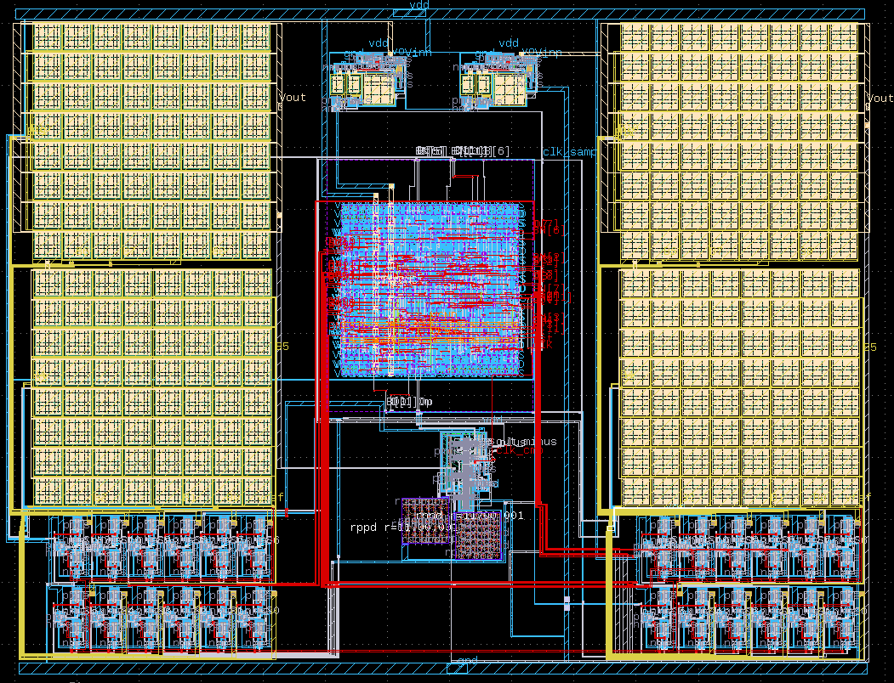
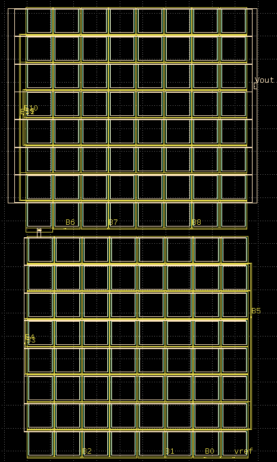
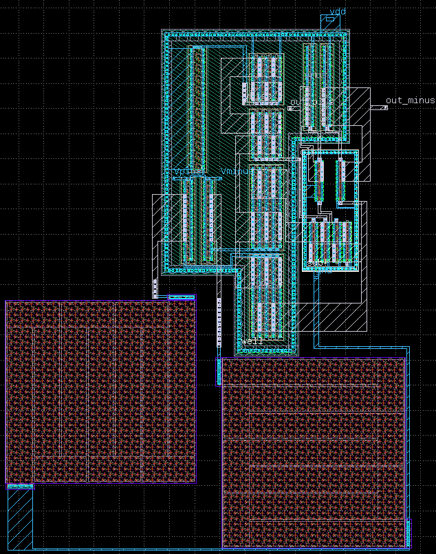
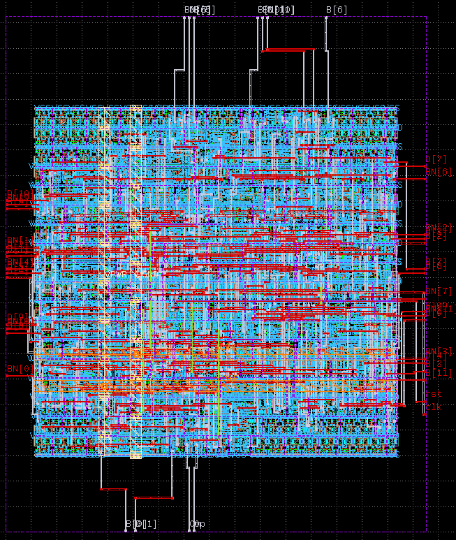

# 12-bit Fully-Differential SAR ADC in IHP SG13G2 (130 nm BiCMOS)

A 12-bit, 2 MS/s successive-approximation-register (SAR) analog-to-digital
converter designed from scratch in the open-source **IHP SG13G2 130 nm SiGe
BiCMOS** PDK. The project spans the complete mixed-signal flow — architecture,
transistor-level design, full-custom analog layout, RTL-to-GDS digital
synthesis, and DRC/LVS-clean verification of every block — using an entirely
open-source toolchain (Xschem, ngspice, KLayout, LibreLane).

---

## Why this project

SAR ADCs dominate medium-resolution, energy-efficient data conversion: they
reuse a single comparator across all bit decisions and dissipate almost no
static power. This work implements a 12-bit differential SAR entirely in an
open-source PDK and toolchain, showing that a complete, verifiable mixed-signal
data converter can be built without any proprietary EDA. Every analog block is
full-custom and individually DRC/LVS clean, and the digital control is taken
through a full RTL-to-GDS flow with timing closed across PVT corners.

---

## Headline results

| Parameter | Value (pre-layout) |
|---|---|
| Resolution | 12 bit |
| Sampling rate | 2 MS/s |
| Supply | 1.2 V |
| **ENOB** | **11.3 bit** |
| SNDR | 69.5 dB |
| SFDR | 78.3 dBFS |
| THD | -80.4 dBc |
| INL (best-fit) | +/-1.16 LSB |
| DNL | < 1 LSB, monotonic, no missing codes |
| Input-referred offset (sigma) | ~ 3.9 LSB (Monte Carlo) |
| Power | ~ 272 uW |
| Walden FOM | ~ 54 fJ/conversion-step (ENOB-based) |
| Schreier FOM | ~ 165 dB |

> **Conditions & honesty notes.** All figures above are **pre-layout** transient
> simulations at the typical corner (TT, 27 °C, 1.2 V). The transient testbench
> excludes device thermal noise, so the simulated ENOB — and the FOM derived
> from it — are noise-optimistic. The dominant noise terms were bounded
> separately: kT/C sampling noise is negligible (~0.07 LSB) for the ~10.5 pF
> total array capacitance, and comparator noise is the limiting term, bounded
> analytically. The full converter is now integrated at top level and runs
> post-layout simulation; parasitic (RC) extraction and the resulting
> extracted-netlist figures are the remaining step, and will be added here once
> complete. Expected post-layout ENOB stays above 10 bit.

---

## Architecture

Fully-differential, synchronous SAR with monotonic ("set-and-down") switching.

```
        +--------------+   +------------+   +----------------+
 Vin -->| Bootstrapped |-->|  Split     |-->| Preamplifier   |
        | Sampling     |   |  6+6 CDAC  |   | + StrongARM    |--> D_out
        | Switch       |   | (bridge    |   |  latch         |    (12 bit)
        +--------------+   |  cap)      |   |  comparator    |
                           +-----^------+   +-------+--------+
                                 | switch          | decision
                                 | control         v
                                 |          +----------------+
                                 +----------| Synchronous    |
                                            | SAR logic      |
                                            | (SystemVerilog |
                                            |  -> LibreLane) |
                                            +----------------+
```



### Block-by-block design

**Bootstrapped sampling switch.**
The front-end sampling switch is bootstrapped to keep its gate-source voltage —
and therefore its on-resistance — constant across the full input swing. The
original sizing produced a signal-dependent on-resistance that collapsed near
the supply rails, injecting H3/H5 distortion and capping ENOB at ~10 bit.
Diagnosing this and resizing the main sampling devices reduced the worst-case
near-rail sampling error from ~89 mV to sub-LSB and raised ENOB to 11.3 bit.

**Split capacitive DAC (CDAC).**
A 6+6 split binary-weighted MIM-capacitor array. The ideal bridge capacitor for
an exact split would be Cb = (64/63)·Cu ≈ 1.016·Cu; here a plain unit capacitor
(Cb = Cu) is used instead, trading a small, bounded weighting error for layout
regularity and better matching of the bridge element. The resulting deviation
is minor and was verified in simulation to stay within the converter's
linearity budget. Monotonic switching reduces reference-settling activity and
switching energy. The array is laid out **common-centroid** (8×8 unit cells) so
linear process gradients cancel; the MSB capacitors are well-centroided and the
bit assignment was validated against the weighting.

**Comparator — preamplifier + StrongARM latch.**
A static preamplifier provides gain and input isolation ahead of a dynamic
StrongARM latch that makes the bit decision. Input-referred offset was
characterized by Monte Carlo over the sg13g2 mismatch models (sigma ~ 3.9 LSB,
unimodal, no bimodality), dominated by input-pair and latch device mismatch.
The preamplifier load resistors are folded serpentine rppd resistors,
interdigitated for matching.

**Synchronous SAR logic.**
The control FSM (sample -> 12 bit-trials -> output) is described in SystemVerilog
(`digital/RTL/sar_logic.sv`) and taken through the LibreLane (OpenLane)
RTL-to-GDS flow. Timing is closed across three PVT corners
(fast/1.32 V/-40 C, typical/1.20 V/25 C, slow/1.08 V/125 C), and the full run —
synthesis, floorplan, placement, CTS, routing, STA, DRC, LVS — is included under
`digital/librelane/runs/`.

---

## Results

### Dynamic performance — ENOB / FFT
Coherent-sampling FFT (N = 128, M = 11 cycles), no windowing.
ENOB = 11.3 bit, SNDR = 69.5 dB, SFDR = 78.3 dBFS.


### Static linearity — INL / DNL
Full-range ramp characterization. Monotonic, no missing codes; INL +/-1.16 LSB.


### Mismatch — Monte Carlo offset
Input-referred offset distribution over sg13g2 mismatch models, sigma ~ 3.9 LSB.


> INL is the reliable static-linearity figure. DNL is a ramp-resolution-limited
> estimate (1 mV ramp ~ 3.4 LSB per step), reported as monotonic with no missing
> codes at the measured resolution; a sub-LSB ramp would resolve true per-code
> DNL.

---

## Layout

All analog blocks are full-custom and laid out in KLayout, each DRC and LVS
clean, and the complete converter is integrated at top level.

| Block | File | Screenshot |
|---|---|---|
| Top-level integrated ADC | `layout/sar_adc_top.gds` | `figures/top_level_layout.png` |
| Split CDAC (common-centroid array) | `layout/cdac.gds` | `figures/cdac_layout.png` |
| Preamp + StrongARM comparator | `layout/dynamic_comparator_preamp.gds` | `figures/comparator_layout.png` |
| Bootstrapped sampling switch | `layout/bootstrap_switch.gds` | - |
| Switch array | `layout/switch_array.gds` | - |
| SAR logic (LibreLane GDS) | `digital/librelane/.../final/gds/sar_logic.gds` | `figures/digital_logic_gds.png` |






---

## Verification status

Every block is **DRC clean and LVS clean** individually:

| Block | DRC | LVS |
|---|---|---|
| Top-level integrated ADC | clean | clean |
| Bootstrapped sampling switch | clean | clean |
| Split CDAC | clean | clean |
| Preamp + StrongARM comparator | clean | clean |
| Switch array | clean | clean |
| SAR logic (LibreLane flow) | clean | clean |

Evidence is committed: extracted netlists (`verification/*_extracted.cir`),
DRC databases (`verification/*.lyrdb`), and the complete LibreLane run including
per-corner STA, DRC (Magic + KLayout), and LVS (Netgen) reports under
`digital/librelane/runs/RUN_FINAL/`.

**Top-level integration is complete:** all blocks are assembled into the full
converter, which is **DRC clean and LVS clean at top level** and runs
post-layout simulation. Parasitic (RC) extraction and the final
parasitic-extracted post-layout simulation are the remaining work item.

---

## Repository structure

```
SAR_ADC/
|-- schematic/      Xschem schematics (.sch) + symbols (.sym), xschemrc
|-- layout/         KLayout analog block layouts (.gds) - DRC & LVS clean
|-- digital/        SAR logic
|   |-- RTL/                SystemVerilog source (sar_logic.sv)
|   |-- librelane/          LibreLane config + full RTL-to-GDS run
|   |   |-- config.yaml
|   |   `-- runs/RUN_FINAL/ all flow stages, reports, final GDS/LEF/lib
|   `-- sar_logic.spice     extracted digital netlist
|-- testbench/      ngspice testbenches (ENOB, INL, Monte Carlo, top, blocks)
|-- scripts/        Python analysis
|   `-- codes/      raw simulation outputs consumed by the scripts
|-- verification/   analog LVS extracted netlists (.cir) + DRC reports (.lyrdb)
`-- figures/        result plots and layout/schematic screenshots
```

---

## Design flow & tools

| Step | Tool |
|---|---|
| Schematic capture | Xschem |
| Circuit simulation | ngspice |
| Custom layout, DRC, LVS | KLayout + IHP SG13G2 runset |
| Digital RTL-to-GDS | LibreLane (OpenLane); OpenROAD, Yosys, Magic, Netgen, KLayout |
| Analysis | Python (NumPy, SciPy, Matplotlib) |
| PDK | IHP-Open-PDK (https://github.com/IHP-GmbH/IHP-Open-PDK), SG13G2 |

This project uses the **IHP Open-Source PDK**, which is **not** redistributed
here (separate repository and license). Install it separately and point the tool
configs (`schematic/xschemrc`, testbench model paths, KLayout runsets, the
LibreLane `PDK`/`PDK_ROOT`) to your local PDK.

---

## Reproducing the results

**Analog characterization**
1. Install IHP-Open-PDK (SG13G2) and set tool paths.
2. Run a testbench in ngspice to produce output codes into `scripts/codes/`.
3. Analyze:
   ```bash
   python3 scripts/enob_analysis.py        # ENOB / SNDR / SFDR / THD
   python3 scripts/calculate_DNL.py        # INL / DNL
   python3 scripts/calculate_histogram.py  # Monte Carlo offset
   ```

**Digital SAR logic**
```bash
cd digital/librelane
librelane config.yaml          # re-runs the full RTL-to-GDS flow
```
The committed `runs/RUN_FINAL/` already contains the final GDS, LEF, timing
libs, and all STA/DRC/LVS reports.

> Testbench decks and configs may use absolute PDK paths - adjust to your local
> install before running.

---

## Key engineering takeaways

- Derived and verified a split-CDAC bridge-capacitor ratio analytically;
  validated mid-scale major-carry linearity in simulation.
- Delivered a fully open-source mixed-signal flow: full-custom analog layout
  (every block DRC/LVS clean) plus digital RTL-to-GDS with timing closed across
  PVT corners.
- Reproducible characterization: every reported metric regenerates from the
  committed raw data via the included Python scripts.

## License

Released under the Apache-2.0 License (see `LICENSE`).
